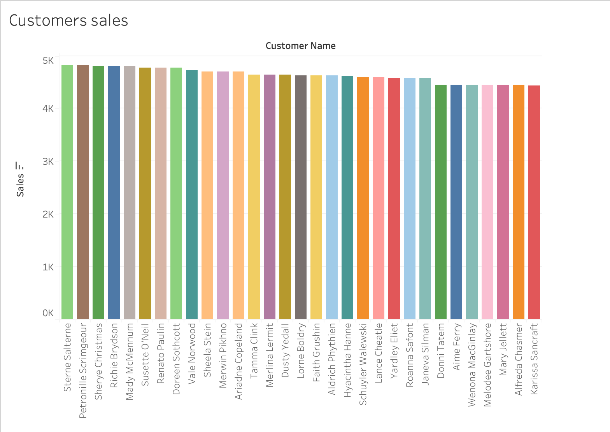
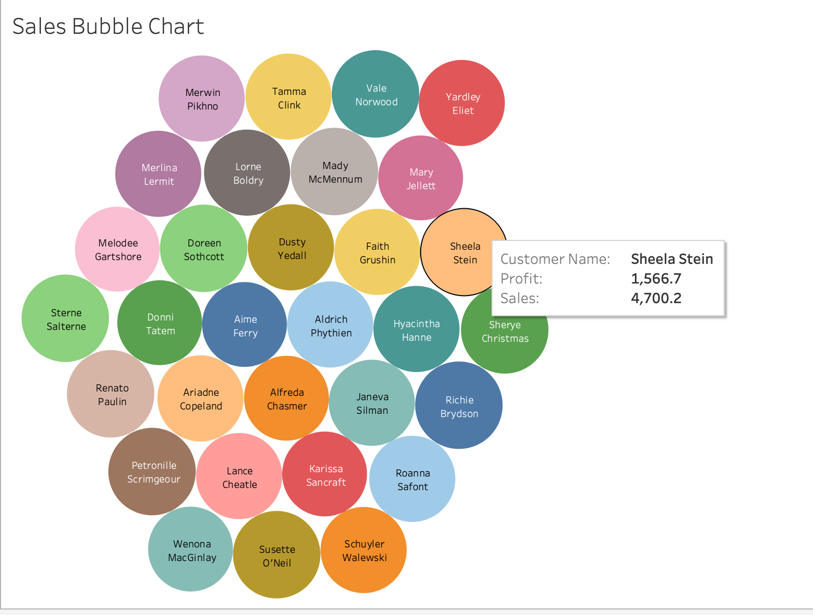
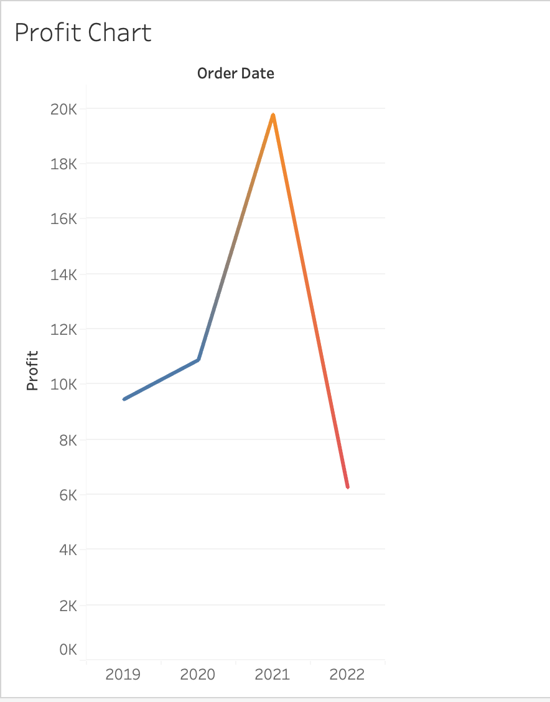
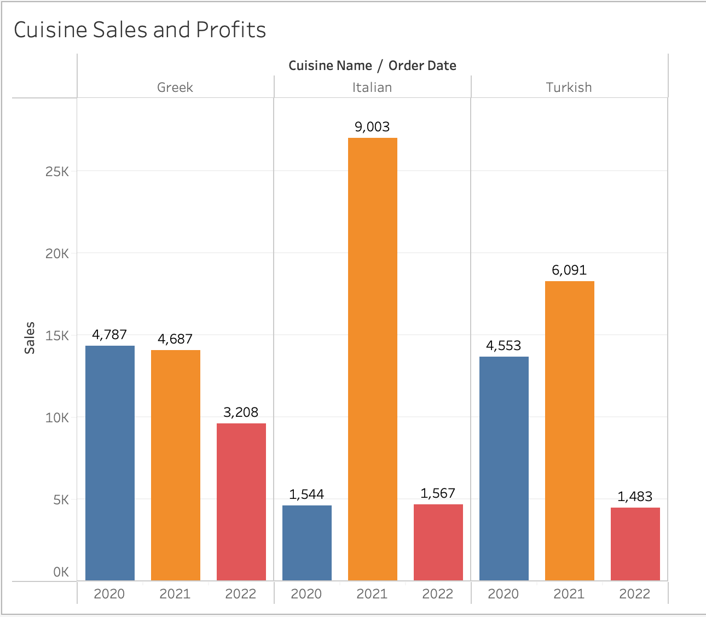
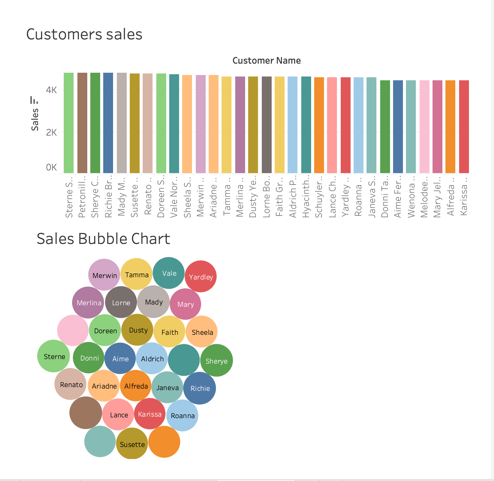
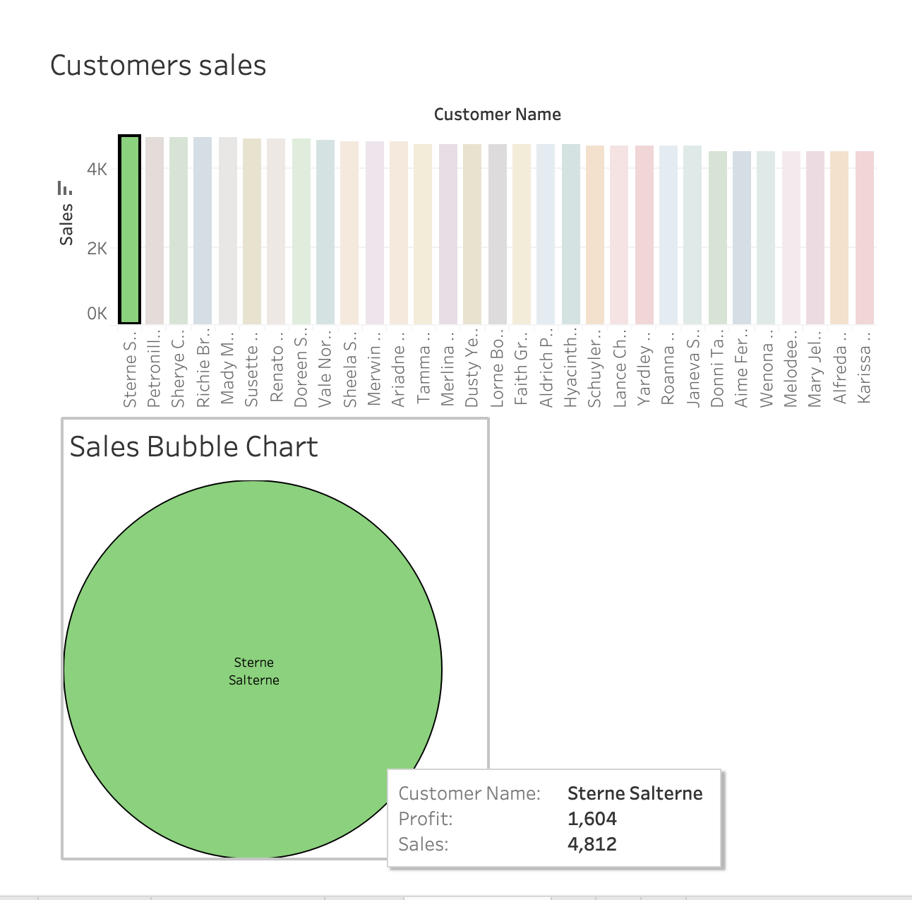
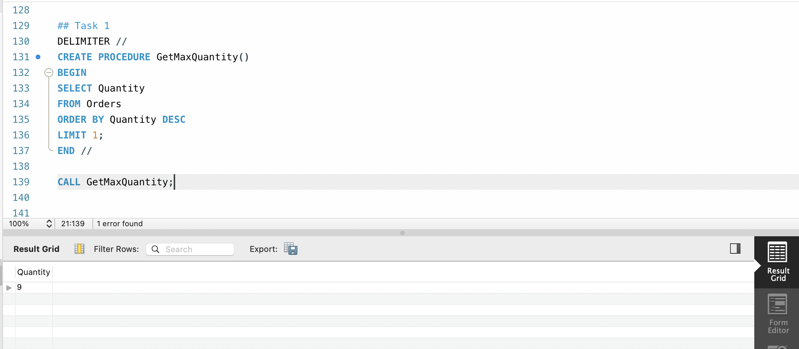
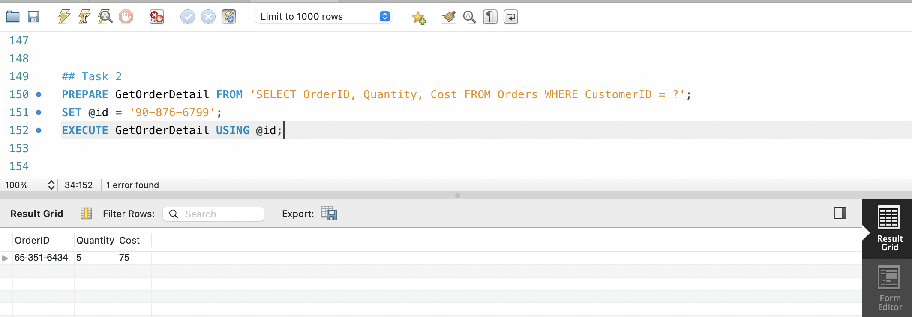

# Little Lemon DB
 
 
Note: This project was completed for Coursera Database Engineering Capstone
 
 

## Table of Contents

* [Little Lemon ER Diagram](#little-lemon-er-diagram)
* [Tableau](#tableau)
* [mySQL Forward Engineering Script](#mySQL-script)
* [mysql](#mysql)

 
 

## ER Diagram

 
 
## Tableau
Screenshots below, full interactive dashboard can be found [here](https://public.tableau.com/app/profile/katie5957/viz/LittleLemon_17033427347240/Dashboard1?publish=yes)
 

 
 
## mySQL Forward Engineering Script
The script can be found in main folder above.  File name:  Little Lemon DM SQL Script
 
 
## mySQL

